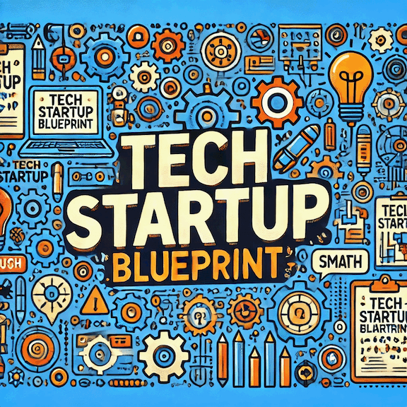

# Technology Startup Blueprint

## Efficient, SOC 2 Compliant, "MVP" Tech Startup Operations with ArgoCD, AWS, and GitHub Actions

### [Tech Startup Blueprint - PDF](https://github.com/kmusard/tech-startup-blueprint/blob/main/tech-startup-blueprint.pdf)

## Additional Resources

- [ArgoCD - Core Concepts](https://argo-cd.readthedocs.io/en/stable/core_concepts/)

- [AWS - Organizing Your AWS Environment Using Multiple Accounts](https://docs.aws.amazon.com/whitepapers/latest/organizing-your-aws-environment/organizing-your-aws-environment)

- [AWS - Permission Sets](https://docs.aws.amazon.com/singlesignon/latest/userguide/permissionsetsconcept.html)

- [DataDog - Fordwarder Lambda](https://docs.datadoghq.com/logs/guide/forwarder/?tab=cloudformation)

- [GitHub - Understanding GitHub Actions](https://docs.github.com/en/actions/about-github-actions/understanding-github-actions)

- [Minimum Viable CD](https://minimumcd.org/minimumcd/)

- [Trunk Based Development - Introduction](https://trunkbaseddevelopment.com/)

- [The Twelve-Factor App](https://12factor.net/)

- [Vanta - What is SOC 2?](https://www.vanta.com/collection/soc-2/what-is-soc-2)
